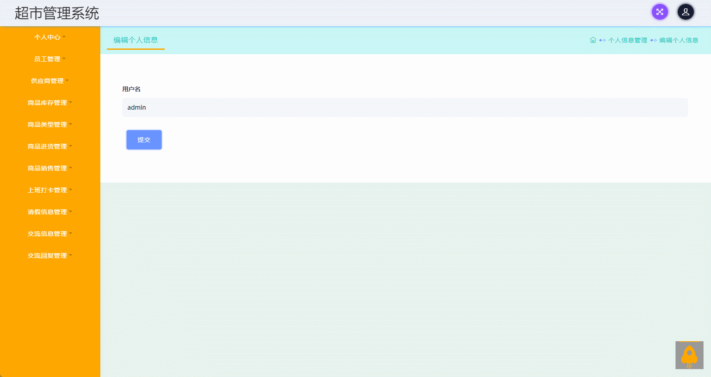

#  supermarket🎂

基于SSM+JSP的超市管理系统

## 介绍🌞

> 其主要服务对象涵盖管理员和员工。该系统的管理员部分包含个人资料库、雇员控制台、供货商监控、产品目录、采购操作、售卖处理、考勤记录、休假数据跟踪、沟通互动模块以及回应策略等；而对于员工而言，他们可以访问的选项有个人信息页面、供货商追踪、产品列表、采购流程、销售活动、考勤登记、休假安排、沟通交互工具及响应策略等等。

## 项目演示🌞

> 管理员



> 员工


## 安装教程🌞

```
1. 运行环境准备mysql8 + java8

2. 配置maven路径，加载依赖

3. 运行sql文件，确保application.yml或config.properties的数据库名称和账号密码是数据库所在主机的账号密码
```


## 使用说明🌞

```
1. 登入

    管理员账号：admin 密码：123456

    员工账号：user 密码：123456
  
2. 运行流程

SpringBoot+Vue项目的部署详情可以查看这篇CSDN博客：http://t.csdnimg.cn/kpuxS

前后端不分离项目的部署流程可以查看这篇CSDN博客：http://t.csdnimg.cn/CslA5
```


## CSDN项目合集🌞

点击前往：http://t.csdnimg.cn/Q4u84


## 联系我🌞

**有偿获取完整源码或调试代码**

🐧：1902317191

微信：


